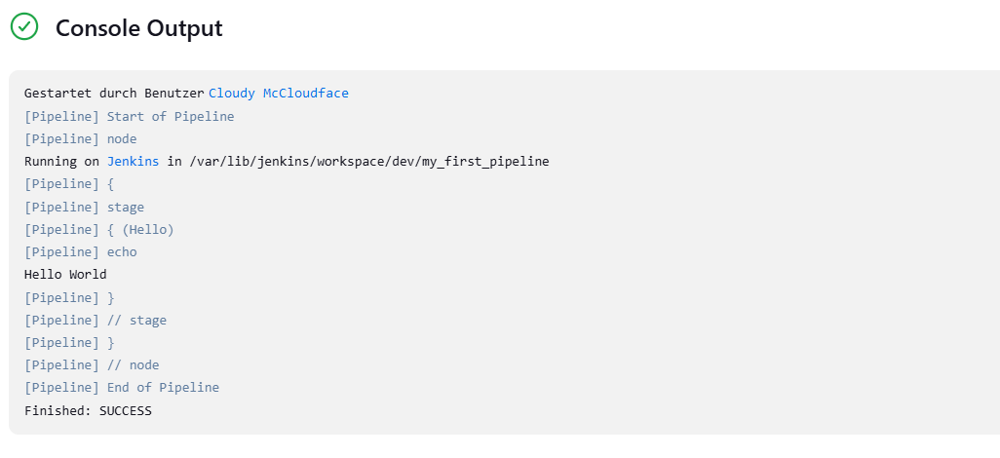

# Step 4_1 - register machine as agent (so we can automatically run stuff)

- go to Jenkins --> Manage Jenkins --> Nodes
- click on "Built-In Node" (german: "Master")
- "Konfigurieren" -> add the label "server"
- you can now run jenkins jobs on this machine via labels
- test your setup with a jenkins pipeline
  - go to jenkins root
  - "New Item" --> Folder "prod"
  - "New Item" --> Folder "dev"
  - click on dev --> Create new Job or new Itmen (left menu) --> Pipeline --> "my_first_pipeline"
  - go to the pipeline section
  - add the Hello World example from "try sample pipeline"
    <details>
        <summary>Hello World Pipeline</summary>

    ```groovy
    pipeline {
        agent any

        stages {
            stage('Hello') {
                steps {
                    echo 'Hello World'
                }
            }
        }
    }
    ```

    </details>

    - can also be found here: [scripts/step_4/pipeline_hello_world.groovy](../scripts/step_4/pipeline_hello_world.groovy)
    - Save the the Pipeline
    - Click on "Build Now":  
    
    - Click on the Build Number, on the lower left, then on "Console Output":   
    